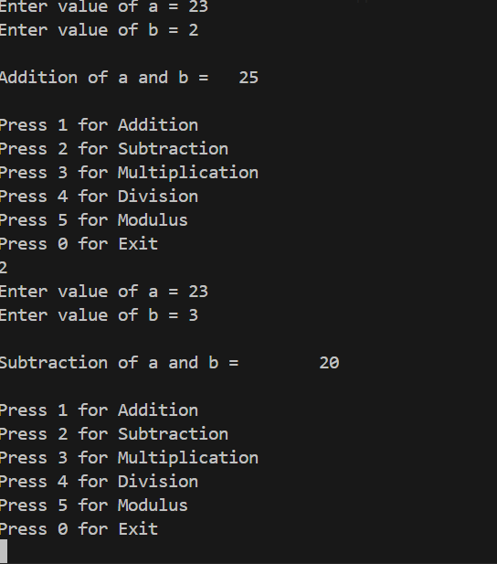

# output

## calculator


# Project Title
A short description of your project and what it does.

## 📌 Table of Contents
- [About](#about)
- [Features](#features)
- [Installation](#installation)
- [Usage](#usage)
- [Screenshots](#screenshots)
- [Technologies Used](#technologies-used)
- [Contributing](#contributing)
- [License](#license)

---

## 📖 About
Explain the purpose of your project, its goals, and who it’s for.  
Example:
> This project is a web-based application that helps users track expenses, generate reports, and manage budgets easily.

---

## ✨ Features
- Feature 1
- Feature 2
- Feature 3

---

## ⚙️ Installation
```bash
# Clone the repository
git clone https://github.com/username/project-name.git

# Navigate to project directory
cd project-name

# Install dependencies
npm install
